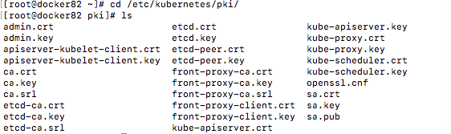
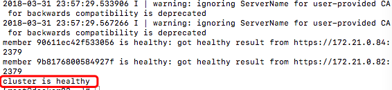
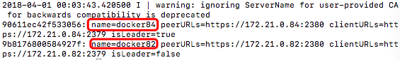
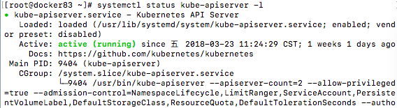
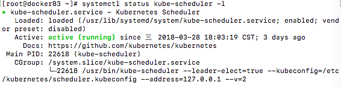
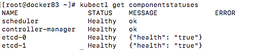
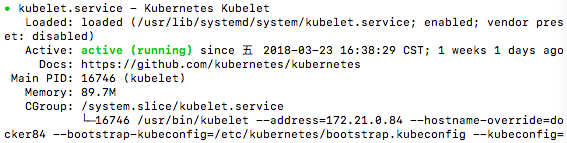
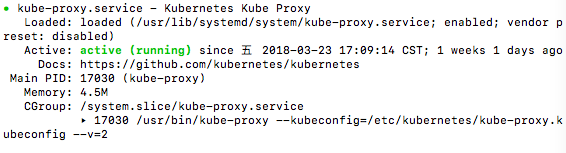

# k8s 1.9.3 安装教程

> 前言
> > 安装过程稍有不慎，易出错。切记谨慎，细心！

### 版本匹配设置
* k8s版本：1.9.3
* OS版本：centos 7.4
* etcd版本：3.1.11
* flannel版本：0.10.0
* docker版本：1.12.6

安装前需准备好相应的二进制可执行文件，并将其拷贝到系统的/usr/bin目录下

### 操作系统配置
基础选择如下：  

* OS类型：centos 7.4 1708
* raid 1 for OS
* raid 5 for data
* 关闭selinux
* 关闭防火墙
* systemctl disable NetworkManager
* 设置cluster net=bond4
* 修改/etc/security/limits.conf
* 同步或者关闭时钟：Clock sync(disable chrony)
* 设置节点间访问授信，修改/etc/hosts配置域名解析
* add "iso repo"，安装nfs
* 修改/etc/sysctl.conf文件,添加如下设置

```
net.ipv4.ip_forward = 1
vm.swappiness=0
net.bridge.bridge-nf-call-ip6tables = 1
net.bridge.bridge-nf-call-iptables = 1
```

### k8s安装
#### master节点安装

1. create dir

```
mkdir /etc/kubernetes/ && mkdir /etc/kubernetes/pki/
```

2. create openssl.cnf  in /etc/kubernetes/pki/

```
[ req ]
distinguished_name = req_distinguished_name
[req_distinguished_name]
[ v3_ca ]
basicConstraints = critical, CA:TRUE
keyUsage = critical, digitalSignature, keyEncipherment, keyCertSign
subjectAltName=IP:10.151.31.163          #负载均衡LB ip。若不用LB，注释掉即可
[ v3_req_server ]
basicConstraints = CA:FALSE
keyUsage = critical, digitalSignature, keyEncipherment
extendedKeyUsage = serverAuth
[ v3_req_client ]
basicConstraints = CA:FALSE
keyUsage = critical, digitalSignature, keyEncipherment
extendedKeyUsage = clientAuth
[ v3_req_apiserver ]
basicConstraints = CA:FALSE
keyUsage = critical, digitalSignature, keyEncipherment
extendedKeyUsage = serverAuth
subjectAltName = @alt_names_cluster
[ v3_req_etcd ]
basicConstraints = CA:FALSE
keyUsage = critical, digitalSignature, keyEncipherment
extendedKeyUsage = serverAuth, clientAuth
subjectAltName = @alt_names_etcd
[ alt_names_cluster ]
DNS.1 = kubernetes
DNS.2 = kubernetes.default
DNS.3 = kubernetes.default.svc
DNS.4 = kubernetes.default.svc.cluster.local
DNS.5 = kube03	#master node01所在节点的hostname
DNS.6 = kube04	#master node02
DNS.7 = kube05	#master node03
IP.1 = 10.151.31.157       #master node01的IP
IP.2 = 10.151.31.158       #master node02
IP.3 = 10.151.31.159       #master node03
IP.4 = 10.151.31.163       #LB ip
IP.5 = 170.10.0.1             #service ip range
IP.6 = 180.20.0.1             #cluster ip range
[ alt_names_etcd ]
DNS.1 = kube03	#etcd node01所在节点的hostname
DNS.2 = kube04	#etcd node02
DNS.3 = kube05	#etcd node02
IP.1 = 10.151.31.157	#etcd node01所在节点的IP
IP.2 = 10.151.31.158	#etcd node02
IP.3 = 10.151.31.159	#etcd node03
IP.4 = 10.151.31.163	#LB IP
IP.5 = 170.10.0.1	#同上
IP.6 = 180.20.0.1
```

3. cd /etc/kubernetes/pki

```
cd /etc/kubernetes/pki
```

4. 生成证书

* k8s CA cert

```
openssl ecparam -name secp521r1 -genkey -noout -out ca.key
chmod 0600 ca.key
openssl req -x509 -new -sha256 -nodes -key ca.key -days 3650 -out ca.crt \
            -subj "/CN=kubernetes-ca"  -extensions v3_ca -config ./openssl.cnf
```

* k8s apiserver cert

```
openssl ecparam -name secp521r1 -genkey -noout -out kube-apiserver.key
chmod 0600 kube-apiserver.key
openssl req -new -sha256 -key kube-apiserver.key -subj "/CN=kube-apiserver" \
  | openssl x509 -req -sha256 -CA ca.crt -CAkey ca.key -CAcreateserial \
                 -out kube-apiserver.crt -days 3650 \
                 -extensions v3_req_apiserver -extfile ./openssl.cnf
```

* apiserver kubelet client cert

```
openssl ecparam -name secp521r1 -genkey -noout -out apiserver-kubelet-client.key
chmod 0600 apiserver-kubelet-client.key
openssl req -new -key apiserver-kubelet-client.key \
            -subj "/CN=kube-apiserver-kubelet-client/O=system:masters" \
  | openssl x509 -req -sha256 -CA ca.crt -CAkey ca.key -CAcreateserial \
                 -out apiserver-kubelet-client.crt -days 3650 \
                 -extensions v3_req_client -extfile ./openssl.cnf
```

* admin client cert

```
openssl ecparam -name secp521r1 -genkey -noout -out admin.key
chmod 0600 admin.key
openssl req -new -key admin.key -subj "/CN=kubernetes-admin/O=system:masters" \
  | openssl x509 -req -sha256 -CA ca.crt -CAkey ca.key -CAcreateserial \
                 -out admin.crt -days 3650 -extensions v3_req_client \
                 -extfile ./openssl.cnf
```

* service account key

```
openssl ecparam -name secp521r1 -genkey -noout -out sa.key
openssl ec -in sa.key -outform PEM -pubout -out sa.pub
chmod 0600 sa.key
openssl req -new -sha256 -key sa.key \
            -subj "/CN=system:kube-controller-manager" \
  | openssl x509 -req -sha256 -CA ca.crt -CAkey ca.key -CAcreateserial \
                 -out sa.crt -days 3650 -extensions v3_req_client \
                 -extfile ./openssl.cnf
```

* kube-scheduler cert

```
openssl ecparam -name secp521r1 -genkey -noout -out kube-scheduler.key
chmod 0600 kube-scheduler.key
openssl req -new -sha256 -key kube-scheduler.key \
            -subj "/CN=system:kube-scheduler" \
  | openssl x509 -req -sha256 -CA ca.crt -CAkey ca.key -CAcreateserial \
                 -out kube-scheduler.crt -days 3650 -extensions v3_req_client \
                 -extfile ./openssl.cnf
```

* front proxy CA cert

```
openssl ecparam -name secp521r1 -genkey -noout -out front-proxy-ca.key
chmod 0600 front-proxy-ca.key
openssl req -x509 -new -sha256 -nodes -key front-proxy-ca.key -days 3650 \
            -out front-proxy-ca.crt -subj "/CN=front-proxy-ca" \
            -extensions v3_ca -config ./openssl.cnf
```

* front proxy client cert

```
openssl ecparam -name secp521r1 -genkey -noout -out front-proxy-client.key
chmod 0600 front-proxy-client.key
openssl req -new -sha256 -key front-proxy-client.key \
            -subj "/CN=front-proxy-client" \
  | openssl x509 -req -sha256 -CA front-proxy-ca.crt \
                 -CAkey front-proxy-ca.key -CAcreateserial \
                 -out front-proxy-client.crt -days 3650 \
                 -extensions v3_req_client -extfile ./openssl.cnf
```

* kube-proxy cert

```
openssl ecparam -name secp521r1 -genkey -noout -out kube-proxy.key
chmod 0600 kube-proxy.key
openssl req -new -key kube-proxy.key \
            -subj "/CN=kube-proxy/O=system:node-proxier" \
  | openssl x509 -req -sha256 -CA ca.crt -CAkey ca.key -CAcreateserial \
                 -out kube-proxy.crt -days 3650 -extensions v3_req_client \
                 -extfile ./openssl.cnf
```

* etcd CA cert

```
openssl ecparam -name secp521r1 -genkey -noout -out etcd-ca.key
chmod 0600 etcd-ca.key
openssl req -x509 -new -sha256 -nodes -key etcd-ca.key -days 3650 \
            -out etcd-ca.crt -subj "/CN=etcd-ca" -extensions v3_ca \
            -config ./openssl.cnf
```

* etcd cert
 
```
 openssl ecparam -name secp521r1 -genkey -noout -out etcd.key
 chmod 0600 etcd.key
 openssl req -new -sha256 -key etcd.key -subj "/CN=etcd" \
  | openssl x509 -req -sha256 -CA etcd-ca.crt -CAkey etcd-ca.key \
                 -CAcreateserial -out etcd.crt -days 3650 \
                -extensions v3_req_etcd -extfile ./openssl.cnf
```

* etcd peer cert

```
openssl ecparam -name secp521r1 -genkey -noout -out etcd-peer.key
chmod 0600 etcd-peer.key
openssl req -new -sha256 -key etcd-peer.key -subj "/CN=etcd-peer" \
  | openssl x509 -req -sha256 -CA etcd-ca.crt -CAkey etcd-ca.key \
                 -CAcreateserial -out etcd-peer.crt -days 3650 \
                 -extensions v3_req_etcd -extfile ./openssl.cnf
```


5. transfer certs to all nodes(包括master,worker和etcd节点)

在集群所有节点创建同样目录/etc/kubernetes，将当前pki目录拷贝到所有节点的/etc/kubernetes下

```
ssh controller$n mkdir /etc/kubernetes/
scp -rp mkdir /etc/kubernetes/pki/ controller$n:/etc/kubernetes
```

6. 生成相关配置文件

* service account kubeconfig

如下变量需替换：

```INTERNAL_IP ：LB ip（安装教程的所有INTERNAL_IP均替换为LB ip。若不使用LB，则替换为当前master节点的ip）```

```{KUBERNETES_PUBLIC_ADDRESS}:6443 ：nginx LB地址：端口（如果没有LB，替换成任意一个apiserver所在节点的ip）```

```
KUBERNETES_PUBLIC_ADDRESS=$INTERNAL_IP	

CLUSTER_NAME="default"
KCONFIG=controller-manager.kubeconfig
KUSER="system:kube-controller-manager"
KCERT=sa

cd /etc/kubernetes/

kubectl config set-cluster ${CLUSTER_NAME} \
  --certificate-authority=pki/ca.crt \
  --embed-certs=true \
  --server=https://${KUBERNETES_PUBLIC_ADDRESS}:6443 \
  --kubeconfig=${KCONFIG}

kubectl config set-credentials ${KUSER} \
  --client-certificate=pki/${KCERT}.crt \
  --client-key=pki/${KCERT}.key \
  --embed-certs=true \
  --kubeconfig=${KCONFIG}

kubectl config set-context ${KUSER}@${CLUSTER_NAME} \
  --cluster=${CLUSTER_NAME} \
  --user=${KUSER} \
  --kubeconfig=${KCONFIG}

kubectl config use-context ${KUSER}@${CLUSTER_NAME} --kubeconfig=${KCONFIG}
kubectl config view --kubeconfig=${KCONFIG}
```

* kube-scheduler kubeconfig

```{KUBERNETES_PUBLIC_ADDRESS}：6443需替换为nginx LB地址：端口```

```
KUBERNETES_PUBLIC_ADDRESS=$INTERNAL_IP

CLUSTER_NAME="default"
KCONFIG=scheduler.kubeconfig
KUSER="system:kube-scheduler"
KCERT=kube-scheduler

cd /etc/kubernetes/

kubectl config set-cluster ${CLUSTER_NAME} \
  --certificate-authority=pki/ca.crt \
  --embed-certs=true \
  --server=https://${KUBERNETES_PUBLIC_ADDRESS}:6443 \
  --kubeconfig=${KCONFIG}

kubectl config set-credentials ${KUSER} \
  --client-certificate=pki/${KCERT}.crt \
  --client-key=pki/${KCERT}.key \
  --embed-certs=true \
  --kubeconfig=${KCONFIG}

kubectl config set-context ${KUSER}@${CLUSTER_NAME} \
  --cluster=${CLUSTER_NAME} \
  --user=${KUSER} \
  --kubeconfig=${KCONFIG}

kubectl config use-context ${KUSER}@${CLUSTER_NAME} --kubeconfig=${KCONFIG}
kubectl config view --kubeconfig=${KCONFIG}
```

* admin kubeconfig

> 该操作生成的配置文件需要拷贝到所有的worker节点的/etc/kubernetes目录下，配置kube-proxy组件时会用到

```{KUBERNETES_PUBLIC_ADDRESS}：6443需替换为nginx LB地址：端口```

```
KUBERNETES_PUBLIC_ADDRESS=$INTERNAL_IP

CLUSTER_NAME="default"
KCONFIG=admin.kubeconfig
KUSER="kubernetes-admin"
KCERT=admin

cd /etc/kubernetes/

kubectl config set-cluster ${CLUSTER_NAME} \
  --certificate-authority=pki/ca.crt \
  --embed-certs=true \
  --server=https://${KUBERNETES_PUBLIC_ADDRESS}:6443 \
  --kubeconfig=${KCONFIG}

kubectl config set-credentials ${KUSER} \
  --client-certificate=pki/${KCERT}.crt \
  --client-key=pki/${KCERT}.key \
  --embed-certs=true \
  --kubeconfig=${KCONFIG}

kubectl config set-context ${KUSER}@${CLUSTER_NAME} \
  --cluster=${CLUSTER_NAME} \
  --user=${KUSER} \
  --kubeconfig=${KCONFIG}

kubectl config use-context ${KUSER}@${CLUSTER_NAME} --kubeconfig=${KCONFIG}
kubectl config view --kubeconfig=${KCONFIG}
```

7. 配置etcd 

etcd的配置只需在etcd节点上配置，且如下操作需要再每个节点上配置

* vim /etc/kubernetes/etcd 

以下变量需替换：

```NAME的kube03：当前etcd所在节点的hostname```

```LISTEN_CLIENT_URLS/ADVERTISE_CLIENT_URLS/INITIAL_ADVERTISE_PEER_URLS/LISTEN_PEER_URLS ：其中的10.151.31.157均替换为当前etcd所在节点ip```

```INITIAL_CLUSTER ：kube0x和ip均替换为集群所有etcd所在节点的hostname+ip```

```
NAME="--name kube03"	
LISTEN_CLIENT_URLS="--listen-client-urls https://10.151.31.157:2379,http://127.0.0.1:2379"		
ADVERTISE_CLIENT_URLS="--advertise-client-urls https://10.151.31.157:2379"
INITIAL_ADVERTISE_PEER_URLS="--initial-advertise-peer-urls https://10.151.31.157:2380"
LISTEN_PEER_URLS="--listen-peer-urls https://10.151.31.157:2380"
INITIAL_CLUSTER_TOKEN="--initial-cluster-token default-27a5f27fe2"
INITIAL_CLUSTER="--initial-cluster kube03=https://10.151.31.157:2380,kube04=https://10.151.31.158:2380,kube05=https://10.151.31.159:2380"		
INITIAL_CLUSTER_STATE="--initial-cluster-state new"
DATA_DIR="--data-dir=/var/lib/etcd"
CERT_FILE="--cert-file=/etc/kubernetes/pki/etcd.crt"
KEY_FILE="--key-file=/etc/kubernetes/pki/etcd.key"
PEER_CERT_FILE="--peer-cert-file=/etc/kubernetes/pki/etcd-peer.crt"
PEER_KEY_FILE="--peer-key-file=/etc/kubernetes/pki/etcd-peer.key"
TRUSTED_CA_FILE="--trusted-ca-file=/etc/kubernetes/pki/etcd-ca.crt"
PEER_TRUSTED_CA_FILE="--peer-trusted-ca-file=/etc/kubernetes/pki/etcd-ca.crt"
```

* vim /usr/lib/systemd/system/etcd.service

```
[Unit]
Description=etcd
Documentation=https://coreos.com/etcd/docs/latest/
After=network.target

[Service]
Type=notify
EnvironmentFile=-/etc/kubernetes/etcd
ExecStart=/usr/bin/etcd \
        $NAME \
        $LISTEN_CLIENT_URLS \
        $ADVERTISE_CLIENT_URLS \
        $INITIAL_ADVERTISE_PEER_URLS \
        $LISTEN_PEER_URLS \
        $INITIAL_CLUSTER_TOKEN \
        $INITIAL_CLUSTER \
        $INITIAL_CLUSTER_STATE \
        $DATA_DIR \
        $CERT_FILE \
        $KEY_FILE \
        $PEER_CERT_FILE \
        $PEER_KEY_FILE \
        $TRUSTED_CA_FILE \
        $PEER_TRUSTED_CA_FILE \
        --peer-client-cert-auth \
        --client-cert-auth

Restart=always
RestartSec=10s

[Install]
WantedBy=multi-user.target
```

* start etcd

```
systemctl daemon-reload
systemctl enable etcd
systemctl start etcd
systemctl status etcd -l
```

* view etcd is working

```
etcdctl \
  --ca-file=/etc/kubernetes/pki/etcd-ca.crt \
  --cert-file=/etc/kubernetes/pki/etcd.crt \
  --key-file=/etc/kubernetes/pki/etcd.key \
  cluster-health
```

```
etcdctl \
  --ca-file=/etc/kubernetes/pki/etcd-ca.crt \
  --cert-file=/etc/kubernetes/pki/etcd.crt \
  --key-file=/etc/kubernetes/pki/etcd.key \
  member list
```


8. register flannel backend network

> 如下操作只需在任意一个etcd节点上配置即可

```endpoints替换为etcd集群的所有节点ip```

```
etcdctl --endpoints=https://10.151.31.157:2379,https://10.151.31.158:2379,https://10.151.31.159:2379 \
  --ca-file=/etc/kubernetes/pki/etcd-ca.crt \
  --cert-file=/etc/kubernetes/pki/etcd.crt \
  --key-file=/etc/kubernetes/pki/etcd.key \
  mkdir /kube-centos/network
  
etcdctl --endpoints=https://10.151.31.157:2379,https://10.151.31.158:2379,https://10.151.31.159:2379 \
  --ca-file=/etc/kubernetes/pki/etcd-ca.crt \
  --cert-file=/etc/kubernetes/pki/etcd.crt \
  --key-file=/etc/kubernetes/pki/etcd.key \
  mk /kube-centos/network/config "{ \"Network\": \"180.20.0.0/16\", \"SubnetLen\": 24, \"Backend\": { \"Type\": \"host-gw\" } }"
```

9. 配置apiserver
* vim /usr/lib/systemd/system/kube-apiserver.service 

以下变量需替换：

```--apiserver-count：master节点数量```

```--advertise-address：当前master所在节点ip```

```--etcd-servers:etcd集群所有节点的ip```

```
[Unit]
Description=Kubernetes API Server
Documentation=https://github.com/kubernetes/kubernetes
After=network.target

[Service]
Type=notify
ExecStart=/usr/bin/kube-apiserver \
  --apiserver-count=2 \		#master节点数量
  --allow-privileged=true \
  --admission-control=NamespaceLifecycle,LimitRanger,ServiceAccount,PersistentVolumeLabel,DefaultStorageClass,ResourceQuota,DefaultTolerationSeconds \
  --authorization-mode=Node,RBAC \
  --secure-port=6443 \
  --bind-address=0.0.0.0 \
  --advertise-address=10.151.31.157 \	#当前master所在节点ip
  --insecure-port=0 \
  --insecure-bind-address=127.0.0.1 \
  --audit-log-maxage=30 \
  --audit-log-maxbackup=3 \
  --audit-log-maxsize=100 \
  --audit-log-path=/var/log/kube-audit.log \
  --client-ca-file=/etc/kubernetes/pki/ca.crt \
  --etcd-cafile=/etc/kubernetes/pki/etcd-ca.crt \
  --etcd-certfile=/etc/kubernetes/pki/etcd.crt \
  --etcd-keyfile=/etc/kubernetes/pki/etcd.key \
  --etcd-servers=https://10.151.31.157:2379,https://10.151.31.158:2379,https://10.151.31.159:2379 \
  --service-account-key-file=/etc/kubernetes/pki/sa.pub \
  --service-cluster-ip-range=170.10.0.0/16 \
  --service-node-port-range=30000-32767 \
  --tls-cert-file=/etc/kubernetes/pki/kube-apiserver.crt \
  --tls-private-key-file=/etc/kubernetes/pki/kube-apiserver.key \
  --enable-bootstrap-token-auth \
  --kubelet-client-certificate=/etc/kubernetes/pki/apiserver-kubelet-client.crt \
  --kubelet-client-key=/etc/kubernetes/pki/apiserver-kubelet-client.key \
  --kubelet-preferred-address-types=InternalIP,ExternalIP,Hostname \
  --requestheader-client-ca-file=/etc/kubernetes/pki/front-proxy-ca.crt \
  --requestheader-username-headers=X-Remote-User \
  --requestheader-group-headers=X-Remote-Group \
  --requestheader-allowed-names=front-proxy-client \
  --requestheader-extra-headers-prefix=X-Remote-Extra- \
  --v=2 \
  --log-dir=/var/log/k8s/
Restart=always
RestartSec=10s

[Install]
WantedBy=multi-user.target
```

* start kube-apiserver

```
systemctl daemon-reload
systemctl enable kube-apiserver
systemctl start kube-apiserver
systemctl status kube-apiserver -l
```


10. controller manager配置
* vim /usr/lib/systemd/system/kube-controller-manager.service

```
[Unit]
Description=Kubernetes Controller Manager
Documentation=https://github.com/kubernetes/kubernetes
After=network.target

[Service]
ExecStart=/usr/bin/kube-controller-manager \
  --kubeconfig=/etc/kubernetes/controller-manager.kubeconfig \
  --address=127.0.0.1 \
  --leader-elect=true \
  --controllers=*,bootstrapsigner,tokencleaner \
  --service-account-private-key-file=/etc/kubernetes/pki/sa.key \
  --insecure-experimental-approve-all-kubelet-csrs-for-group=system:bootstrappers \
  --cluster-cidr=180.20.0.0/16 \
  --cluster-name=default \
  --service-cluster-ip-range=170.10.0.0/16 \
  --cluster-signing-cert-file=/etc/kubernetes/pki/ca.crt \
  --cluster-signing-key-file=/etc/kubernetes/pki/ca.key \
  --root-ca-file=/etc/kubernetes/pki/ca.crt \
  --use-service-account-credentials=true \
  --v=2
Restart=always
RestartSec=10s

[Install]
WantedBy=multi-user.target
```

* start kube-controller-manager

```
systemctl daemon-reload
systemctl enable kube-controller-manager
systemctl start kube-controller-manager
systemctl status kube-controller-manager -l
```


11. scheduler配置
* vim /usr/lib/systemd/system/kube-scheduler.service 

```
[Unit]
Description=Kubernetes Scheduler
Documentation=https://github.com/kubernetes/kubernetes
After=network.target

[Service]
ExecStart=/usr/bin/kube-scheduler \
  --leader-elect=true \
  --kubeconfig=/etc/kubernetes/scheduler.kubeconfig \
  --address=127.0.0.1 \
  --v=2
Restart=always
RestartSec=10s

[Install]
WantedBy=multi-user.target
```

* start kube-scheduler

```
systemctl daemon-reload
systemctl enable kube-scheduler
systemctl start kube-scheduler
systemctl status kube-scheduler -l
```


12. check component status

```
export KUBECONFIG=/etc/kubernetes/admin.kubeconfig
kubectl version
kubectl get componentstatuses
```


13. bootstrap相关配置

* generate bootstrap token

BOOTSTRAP_TOKEN值需要保存下来，配置worker节点时需要。
且只需在一个master节点上生成，所有master共用同一个值

```
TOKEN_PUB=$(openssl rand -hex 3)
TOKEN_SECRET=$(openssl rand -hex 8)
BOOTSTRAP_TOKEN=“${TOKEN_PUB}.${TOKEN_SECRET}”   

kubectl -n kube-system create secret generic bootstrap-token-${TOKEN_PUB} \
        --type 'bootstrap.kubernetes.io/token' \
        --from-literal description="cluster bootstrap token" \
        --from-literal token-id=${TOKEN_PUB} \
        --from-literal token-secret=${TOKEN_SECRET} \
        --from-literal usage-bootstrap-authentication=true \
        --from-literal usage-bootstrap-signing=true

kubectl -n kube-system get secret/bootstrap-token-${TOKEN_PUB} -o yaml
```

* create bootstrap kubeconfig

以下变量需替换：

```
{KUBERNETES_PUBLIC_ADDRESS}:6443 ：负载均衡的ip和端口
```

```
KUBERNETES_PUBLIC_ADDRESS=$INTERNAL_IP

CLUSTER_NAME="default"
KCONFIG="bootstrap.kubeconfig"
KUSER="kubelet-bootstrap"

cd /etc/kubernetes

kubectl config set-cluster ${CLUSTER_NAME} \
  --certificate-authority=pki/ca.crt \
  --embed-certs=true \
  --server=https://${KUBERNETES_PUBLIC_ADDRESS}:6443 \
  --kubeconfig=${KCONFIG}

kubectl config set-context ${KUSER}@${CLUSTER_NAME} \
  --cluster=${CLUSTER_NAME} \
  --user=${KUSER} \
  --kubeconfig=${KCONFIG}

kubectl config use-context ${KUSER}@${CLUSTER_NAME} --kubeconfig=${KCONFIG}
kubectl config view --kubeconfig=${KCONFIG}
```

* expose CA and bootstrap kubeconfig via configmap

> 该操作只需在一个master上操作即可

```
kubectl -n kube-public create configmap cluster-info \
        --from-file /etc/kubernetes/pki/ca.crt \
        --from-file /etc/kubernetes/bootstrap.kubeconfig
```

* allow anonymous to access cm

> 该操作只需在一个master上操作即可

```
kubectl -n kube-public create role system:bootstrap-signer-clusterinfo \
        --verb get --resource configmaps
        
kubectl -n kube-public create rolebinding kubeadm:bootstrap-signer-clusterinfo \
        --role system:bootstrap-signer-clusterinfo --user system:anonymous
```

* allow worker node to join cluster

> 该操作只需在一个master上操作即可

```
kubectl create clusterrolebinding kubeadm:kubelet-bootstrap \
        --clusterrole system:node-bootstrapper --group system:bootstrappers
```


#### worker节点安装

1. flannel安装

> 注：flannel最好也装在master节点上

* vim /etc/kubernetes/flanneld

```etcd-endpoints替换为etcd集群所有的节点   ```

```
FLANNEL_ETCD_ENDPOINTS="-etcd-endpoints=https://10.151.31.157:2379,https://10.151.31.158:2379,https://10.151.31.159:2379"
FLANNEL_ETCD_PREFIX="-etcd-prefix=/kube-centos/network"
FLANNEL_OPTIONS="-etcd-cafile=/etc/kubernetes/pki/etcd-ca.crt -etcd-certfile=/etc/kubernetes/pki/etcd.crt -etcd-keyfile=/etc/kubernetes/pki/etcd.key"
```

* vim modify /usr/lib/systemd/system/flanneld.service

```
[Unit]
Description=Flanneld overlay address etcd agent
After=network.target
After=network-online.target
Wants=network-online.target
After=etcd.service
Before=docker.service

[Service]
Type=notify
EnvironmentFile=/etc/kubernetes/flanneld
EnvironmentFile=-/etc/sysconfig/docker-network
ExecStart=/usr/bin/flanneld \
        $FLANNEL_ETCD_ENDPOINTS \
        $FLANNEL_ETCD_PREFIX \
        $FLANNEL_OPTIONS \
        -ip-masq=false
Restart=on-failure

[Install]
WantedBy=multi-user.target
RequiredBy=docker.service
```

* start flannel

```
systemctl daemon-reload
systemctl start flanneld
```

2. docker安装

* vim /usr/lib/systemd/system/docker.service

以下变量需替换:

```--bip：flannel实际部署时分配的ip ```

```--insecure-registry：镜像仓库的网段```

```
[Unit]
Description=Docker Application Container Engine
Documentation=https://docs.docker.com
After=network.target

[Service]
Type=notify
# the default is not to use systemd for cgroups because the delegate issues still
# exists and systemd currently does not support the cgroup feature set required
# for containers run by docker
ExecStart=/usr/bin/dockerd \
        --iptables=false \
        --storage-driver overlay \
        --bip=180.20.20.1/24 \
        --insecure-registry=10.151.31.0/24 \
        --ip-masq=false
ExecReload=/bin/kill -s HUP $MAINPID
# Having non-zero Limit*s causes performance problems due to accounting overhead
# in the kernel. We recommend using cgroups to do container-local accounting.
LimitNOFILE=1000000
LimitNPROC=infinity
LimitCORE=infinity
# Uncomment TasksMax if your systemd version supports it.
# Only systemd 226 and above support this version.
#TasksMax=infinity
TimeoutStartSec=0
# set delegate yes so that systemd does not reset the cgroups of docker containers
Delegate=yes
# kill only the docker process, not all processes in the cgroup
KillMode=process

[Install]
WantedBy=multi-user.target
```

* start docker

```
systemctl daemon-reload
systemctl enable docker
systemctl start docker
```

3. Retrive CA and bootstrap kubeconfig on master node

> 以下操作查看相关配置是否正常生产，在master或node上操作均可

以下变量需替换:

```k8s-controller-1:6443: 负载均衡的IP和端口 ```

```
kubectl -n kube-public get cm/cluster-info \
        --server https://k8s-controller-1:6443 --insecure-skip-tls-verify=true \
        --username=system:anonymous --output=jsonpath='{.data.ca\.crt}' \
  | tee /etc/kubernetes/pki/ca.crt


kubectl -n kube-public get cm/cluster-info \
        --server https://k8s-controller-1:6443 --insecure-skip-tls-verify=true \
        --username=system:anonymous \
        --output=jsonpath='{.data.bootstrap\.kubeconfig}' \
  | tee /etc/kubernetes/bootstrap.kubeconfig
```

4. inject BOOTSTRAP_TOKEN to bootstrap kubeconfig

> 执行以下read命令时，需要输入BOOTSTRAP_TOKEN值，该值在安装master节点时已生成

```
read -r -s -p "BOOTSTRAP_TOKEN: " BOOTSTRAP_TOKEN

kubectl config set-credentials kubelet-bootstrap \
  --token=${BOOTSTRAP_TOKEN} \
  --kubeconfig=/etc/kubernetes/bootstrap.kubeconfig
```

5. kubelet安装

* vim /usr/lib/systemd/system/kubelet.service 

以下变量需替换:

```--address:kubelet所在节点的ip```

```--hostname-override:kubelet所在节点的hostname```

```
[Unit]
Description=Kubernetes Kubelet
Documentation=https://github.com/kubernetes/kubernetes
After=docker.service
Requires=docker.service

[Service]
ExecStart=/usr/bin/kubelet \
  --address=10.151.31.160 \
  --hostname-override=kube06 \
  --bootstrap-kubeconfig=/etc/kubernetes/bootstrap.kubeconfig \
  --kubeconfig=/etc/kubernetes/kubelet.kubeconfig \
  --require-kubeconfig=true \
  --pod-manifest-path=/etc/kubernetes/manifests \
  --allow-privileged=true \
  --cluster-dns=170.10.0.10 \
  --cluster-domain=cluster.local. \
  --client-ca-file=/etc/kubernetes/pki/ca.crt \
  --cgroup-driver=cgroupfs \
  --cert-dir=/etc/kubernetes
Restart=always
RestartSec=10s

[Install]
WantedBy=multi-user.target
```

* start kubelet

```
systemctl daemon-reload
systemctl enable kubelet
systemctl start kubelet
systemctl status kubelet -l
```


6. kube-proxy安装

* create kube-proxy service account

```
kubectl -n kube-system create serviceaccount kube-proxy
```

* create kube-proxy kubeconfig

```
INTERNAL_IP=$(hostname -I | awk '{print $1}')
KUBERNETES_PUBLIC_ADDRESS=$INTERNAL_IP

export KUBECONFIG=/etc/kubernetes/admin.kubeconfig
SECRET=$(kubectl -n kube-system get sa/kube-proxy \
                 --output=jsonpath='{.secrets[0].name}')
JWT_TOKEN=$(kubectl -n kube-system get secret/$SECRET \
                    --output=jsonpath='{.data.token}' | base64 -d)

CLUSTER_NAME="default"
KCONFIG="kube-proxy.kubeconfig"
cd /etc/kubernetes

kubectl config set-cluster ${CLUSTER_NAME} \
  --certificate-authority=pki/ca.crt \
  --embed-certs=true \
  --server=https://${KUBERNETES_PUBLIC_ADDRESS}:6443 \
  --kubeconfig=${KCONFIG}

kubectl config set-context ${CLUSTER_NAME} \
  --cluster=${CLUSTER_NAME} \
  --user=default \
  --namespace=default \
  --kubeconfig=${KCONFIG}

kubectl config set-credentials ${CLUSTER_NAME} \
  --token=${JWT_TOKEN} \
  --kubeconfig=${KCONFIG}

kubectl config use-context ${CLUSTER_NAME} --kubeconfig=${KCONFIG}
kubectl config view --kubeconfig=${KCONFIG}
```

* bind a service account 

> 注：该操作在一个节点上执行即可

```
kubectl create clusterrolebinding kubeadm:node-proxier \
        --clusterrole system:node-proxier \
        --serviceaccount kube-system:kube-proxy
```

* transfer kube-proxy kubeconfig to other worker nodes

拷贝生成的kube-proxy配置文件到其他的工作节点上

```
scp -p /etc/kubernetes/kube-proxy.kubeconfig $i:/etc/kubernetes/
```

* vim /usr/lib/systemd/system/kube-proxy.service 

```
[Unit]
Description=Kubernetes Kube Proxy
Documentation=https://github.com/kubernetes/kubernetes
After=network.target

[Service]
ExecStart=/usr/bin/kube-proxy \
  --kubeconfig=/etc/kubernetes/kube-proxy.kubeconfig \
  --v=2
Restart=always
RestartSec=10s

[Install]
WantedBy=multi-user.target
```

* start kube-proxystart kube-proxy

```
systemctl daemon-reload
systemctl enable kube-proxy
systemctl start kube-proxy
systemctl status kube-proxy -l
```


7. 健康检查
* cluster/validate-cluster.sh
```
KUBECTL_PATH=$(which kubectl) NUM_NODES=3 KUBERNETES_PROVIDER=local cluster/validate-cluster.sh
```


### 安装KubeDNS
-----------------

#### 镜像准备
-----------------

安装KubeDNS要准备如下镜像：

* hongchhe/k8s-dns-kube-dns-amd64:1.14.7

* hongchhe/k8s-dns-dnsmasq-nanny-amd64:1.14.7

* hongchhe/k8s-dns-sidecar-amd64:1.14.7

#### 准备配置文件
-----------------

准备KubeDNS所需的配置文件：

将master节点上的`/etc/kubernetes/admin.kubeconfig` 拷贝志每台Node节点上的`/dns-kubeconfig/admin.kubeconfig`，接下来创建KubeDNS的资源对象。

#### 创建KubeDNS
-----------------

```bash
cat kube-dns.yaml
```

```yaml
# Copyright 2016 The Kubernetes Authors.
#
# Licensed under the Apache License, Version 2.0 (the "License");
# you may not use this file except in compliance with the License.
# You may obtain a copy of the License at
#
#     http://www.apache.org/licenses/LICENSE-2.0
#
# Unless required by applicable law or agreed to in writing, software
# distributed under the License is distributed on an "AS IS" BASIS,
# WITHOUT WARRANTIES OR CONDITIONS OF ANY KIND, either express or implied.
# See the License for the specific language governing permissions and
# limitations under the License.

# Should keep target in cluster/addons/dns-horizontal-autoscaler/dns-horizontal-autoscaler.yaml
# in sync with this file.

# __MACHINE_GENERATED_WARNING__

apiVersion: v1
kind: Service
metadata:
  name: kube-dns
  namespace: kube-system
  labels:
    k8s-app: kube-dns
    kubernetes.io/cluster-service: "true"
    addonmanager.kubernetes.io/mode: Reconcile
    kubernetes.io/name: "KubeDNS"
spec:
  selector:
    k8s-app: kube-dns
  clusterIP: 170.10.0.10 
  ports:
  - name: dns
    port: 53
    protocol: UDP
  - name: dns-tcp
    port: 53
    protocol: TCP
---
apiVersion: v1
kind: ServiceAccount
metadata:
  name: kube-dns
  namespace: kube-system
  labels:
    kubernetes.io/cluster-service: "true"
    addonmanager.kubernetes.io/mode: Reconcile
---
apiVersion: v1
kind: ConfigMap
metadata:
  name: kube-dns
  namespace: kube-system
  labels:
    addonmanager.kubernetes.io/mode: EnsureExists
---
apiVersion: extensions/v1beta1
kind: Deployment
metadata:
  name: kube-dns
  namespace: kube-system
  labels:
    k8s-app: kube-dns
    kubernetes.io/cluster-service: "true"
    addonmanager.kubernetes.io/mode: Reconcile
spec:
  # replicas: not specified here:
  # 1. In order to make Addon Manager do not reconcile this replicas parameter.
  # 2. Default is 1.
  # 3. Will be tuned in real time if DNS horizontal auto-scaling is turned on.
  strategy:
    rollingUpdate:
      maxSurge: 10%
      maxUnavailable: 0
  selector:
    matchLabels:
      k8s-app: kube-dns
  template:
    metadata:
      labels:
        k8s-app: kube-dns
      annotations:
        scheduler.alpha.kubernetes.io/critical-pod: ''
    spec:
      tolerations:
      - key: "CriticalAddonsOnly"
        operator: "Exists"
      volumes:
      - name: kube-dns-config
        configMap:
          name: kube-dns
          optional: true
      - name: dns-kubeconfig
        hostPath:
          path: /dns-kubeconfig
      containers:
      - name: kubedns
        image: hongchhe/k8s-dns-kube-dns-amd64:1.14.7
        resources:
          # TODO: Set memory limits when we've profiled the container for large
          # clusters, then set request = limit to keep this container in
          # guaranteed class. Currently, this container falls into the
          # "burstable" category so the kubelet doesn't backoff from restarting it.
          limits:
            memory: 170Mi
          requests:
            cpu: 100m
            memory: 70Mi
        livenessProbe:
          httpGet:
            path: /healthcheck/kubedns
            port: 10054
            scheme: HTTP
          initialDelaySeconds: 60
          timeoutSeconds: 5
          successThreshold: 1
          failureThreshold: 5
        readinessProbe:
          httpGet:
            path: /readiness
            port: 8081
            scheme: HTTP
          # we poll on pod startup for the Kubernetes master service and
          # only setup the /readiness HTTP server once that's available.
          initialDelaySeconds: 3
          timeoutSeconds: 5
        args:
        - --domain=cluster.local.
        - --dns-port=10053
        - --config-dir=/kube-dns-config
        - --kubecfg-file=/dns-kubeconfig/admin.kubeconfig
        - --v=2
        env:
        - name: PROMETHEUS_PORT
          value: "10055"
        ports:
        - containerPort: 10053
          name: dns-local
          protocol: UDP
        - containerPort: 10053
          name: dns-tcp-local
          protocol: TCP
        - containerPort: 10055
          name: metrics
          protocol: TCP
        volumeMounts:
        - name: kube-dns-config
          mountPath: /kube-dns-config
        - name: dns-kubeconfig
          mountPath: /dns-kubeconfig
      - name: dnsmasq
        image: hongchhe/k8s-dns-dnsmasq-nanny-amd64:1.14.7
        livenessProbe:
          httpGet:
            path: /healthcheck/dnsmasq
            port: 10054
            scheme: HTTP
          initialDelaySeconds: 60
          timeoutSeconds: 5
          successThreshold: 1
          failureThreshold: 5
        args:
        - -v=2
        - -logtostderr
        - -configDir=/etc/k8s/dns/dnsmasq-nanny
        - -restartDnsmasq=true
        - --
        - -k
        - --cache-size=1000
        - --no-negcache
        - --log-facility=-
        - --server=/cluster.local./127.0.0.1#10053
        - --server=/in-addr.arpa/127.0.0.1#10053
        - --server=/ip6.arpa/127.0.0.1#10053
        ports:
        - containerPort: 53
          name: dns
          protocol: UDP
        - containerPort: 53
          name: dns-tcp
          protocol: TCP
        # see: https://github.com/kubernetes/kubernetes/issues/29055 for details
        resources:
          requests:
            cpu: 150m
            memory: 20Mi
        volumeMounts:
        - name: kube-dns-config
          mountPath: /etc/k8s/dns/dnsmasq-nanny
      - name: sidecar
        image: hongchhe/k8s-dns-sidecar-amd64:1.14.7
        livenessProbe:
          httpGet:
            path: /metrics
            port: 10054
            scheme: HTTP
          initialDelaySeconds: 60
          timeoutSeconds: 5
          successThreshold: 1
          failureThreshold: 5
        args:
        - --v=2
        - --logtostderr
        - --probe=kubedns,127.0.0.1:10053,kubernetes.default.svc.cluster.local.,5,SRV
        - --probe=dnsmasq,127.0.0.1:53,kubernetes.default.svc.cluster.local.,5,SRV
        ports:
        - containerPort: 10054
          name: metrics
          protocol: TCP
        resources:
          requests:
            memory: 20Mi
            cpu: 10m
      dnsPolicy: Default  # Don't use cluster DNS.
      serviceAccountName: kube-dns
```

```bash
kubectl create -f kube-dns.yaml
```

```bash
kubectl get svc,deployment,pods,configmap,sa -n kube-system

NAME           TYPE        CLUSTER-IP    EXTERNAL-IP   PORT(S)         AGE
svc/kube-dns   ClusterIP   170.10.0.10   <none>        53/UDP,53/TCP   1d
svc/kubelet    ClusterIP   None          <none>        10250/TCP       3d

NAME              DESIRED   CURRENT   UP-TO-DATE   AVAILABLE   AGE
deploy/kube-dns   1         1         1            1           1d

NAME                           READY     STATUS    RESTARTS   AGE
po/kube-dns-7745bd9c5b-4w4fj   3/3       Running   0          1d

NAME                                    DATA      AGE
cm/extension-apiserver-authentication   6         8d
cm/kube-dns                             0         1d

NAME                                    SECRETS   AGE
sa/attachdetach-controller              1         8d
sa/bootstrap-signer                     1         8d
sa/certificate-controller               1         8d
sa/clusterrole-aggregation-controller   1         8d
sa/cronjob-controller                   1         8d
sa/daemon-set-controller                1         8d
sa/default                              1         8d
sa/deployment-controller                1         8d
sa/disruption-controller                1         8d
sa/endpoint-controller                  1         8d
sa/generic-garbage-collector            1         8d
sa/horizontal-pod-autoscaler            1         8d
sa/job-controller                       1         8d
sa/kube-dns                             1         1d
sa/kube-proxy                           1         8d
sa/namespace-controller                 1         8d
sa/node-controller                      1         8d
sa/persistent-volume-binder             1         8d
sa/pod-garbage-collector                1         8d
sa/replicaset-controller                1         8d
sa/replication-controller               1         8d
sa/resourcequota-controller             1         8d
sa/service-account-controller           1         8d
sa/service-controller                   1         8d
sa/statefulset-controller               1         8d
sa/token-cleaner                        1         8d
sa/ttl-controller                       1         8d
```
--------------至此，安装教程结束--------------
